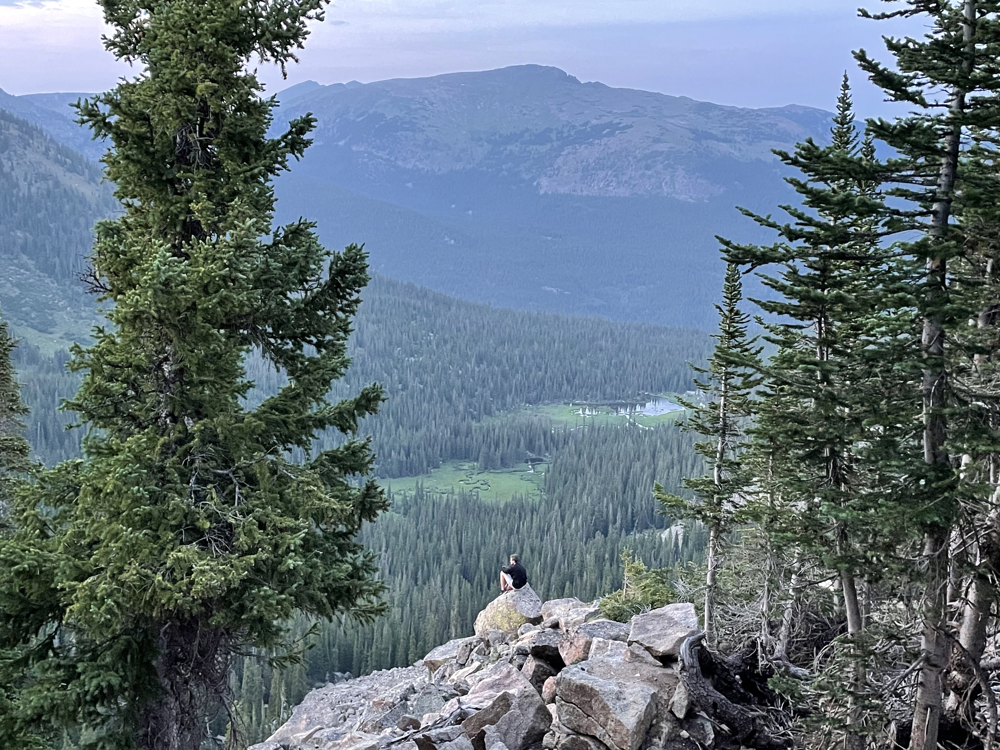

# sicknasty13.github.io
Project #1
<!DOCTYPE html>
    <html lang="en">
    <head> 
     <link>
     <title> LabProject #1 </title>
    </head>

<body>

<header style="color:black;font-family:Papyrus;text-align:center;font-size:15px"> <h1>Action without a name, without a who behind it, is meaningless. -Hanna Rendt</h1>
</header>
<nav style="text-align:center;font-size:25px;">      <h> Alec Moritz 
        </h>
</nav>
<section style="width:250px;height:250px;">
    
 
     
    

</section>
<article>
    
    Coming from Vail, where everything was the same           
      Cool place, but missing the Midwestern "Nice"                                      
      Now there is boundless opportunity for change  
      The saturdays, where its either study or tailgate on ice          
      Madison lives up to the name, the fame                
      Here I feel like I can do anything  			                                        
       Even put a poem here, no shame			  	                                        
      Hope you don't complain                
    

<article>    

 I do love the nature of Colorado and am starting to miss the mountains more as it starts to snow across the West.
  Skiing is one of my first loves and I love to try and do it as much as I can every Winter. Vail mountain is also world renowned and I am blessed to call that mountain home. I am excited for the first few snows here but after that it just means cold. 

</article>
<aside>
    
    
</aside>
<footer>
    
    
</footer>

 
  
  
  
  
  </body>

 
  
  
  
  
  </body>

</html>
